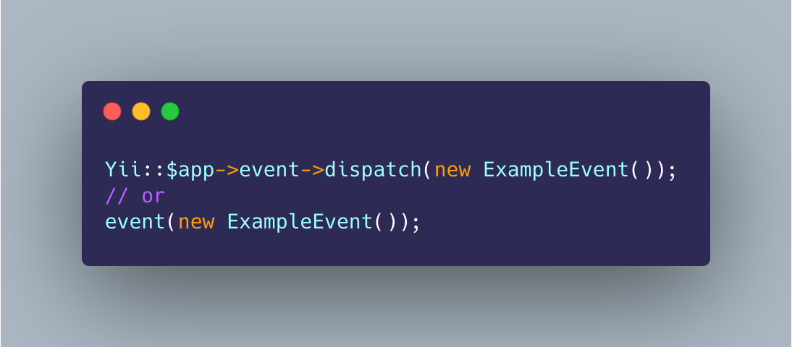

# yii-event

> Elegant usage events in Yii. - 在 Yii 中优雅的使用事件。

<p align="center"></p>

[](https://github.com/guanguans/yii-event/actions)
[](https://github.com/guanguans/yii-event/actions)
[](https://codecov.io/gh/guanguans/yii-event)
[](//packagist.org/packages/guanguans/yii-event)
[](//packagist.org/packages/guanguans/yii-event)
[](//packagist.org/packages/guanguans/yii-event)

## Requirement

* Yii > 2.0

## Installation

``` bash
$ composer require guanguans/yii-event -vvv
```

## Configuration

``` php
...
'components' => [
    ...
    'event' => [
        'class' => \Guanguans\YiiEvent\Event::class,
        'listen' => [
            \app\events\ExampleEvent::class => [
                \app\listeners\ExampleListener::class,
            ],
        ],
    ],
    ...
],
...
```

## Usage

### Create `app\events\ExampleEvent.php`

``` php
namespace app\events;

use yii\base\Event;

class ExampleEvent extends Event
{
    public $name = 'example';
}
```

### Create `app\listeners\ExampleListener.php`

``` php
namespace app\listeners;

use Guanguans\YiiEvent\ListenerInterface;
use yii\base\Event;

class ExampleListener implements ListenerInterface
{
    public function handle(Event $event)
    {
        // to do something.
        var_export($event->name);
        // var_export($event->data);
    }
}
```

### Dispatch event

``` php
Yii::$app->event->dispatch(new ExampleEvent());
// Yii::$app->event->dispatch(new ExampleEvent(), $data);
// or
event(new ExampleEvent());
// event(new ExampleEvent(), $data);
```

### Output result

``` php
'example'
```

## Testing

``` bash
$ composer test
```

## Changelog

Please see [CHANGELOG](CHANGELOG.md) for more information on what has changed recently.

## Contributing

Please see [CONTRIBUTING](.github/CONTRIBUTING.md) for details.

## Security Vulnerabilities

Please review [our security policy](../../security/policy) on how to report security vulnerabilities.

## Credits

* [guanguans](https://github.com/guanguans)
* [All Contributors](../../contributors)

## License

The MIT License (MIT). Please see [License File](LICENSE) for more information.
